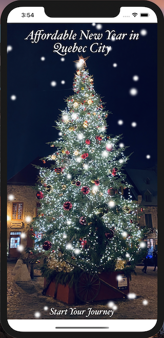

# Quebec3

## Description:

This application has its target to promote affordable travelling. It has different sections of sightseeings, based on the traveller's budget (free, budget, and luxury) to give the opportunity to everyone to explore Quebec City without beeing depended from money. Other sections include city's creperies (where you can get breakfast, lunch and dinner) and basic French Dictionary with audio pronauncetion. 

Enjoy Travelling!

//## Code snippet of the most challenging part of the project:

```swift
func challengingFunc() {
// code hetre
let name = "John Appleseed"
}
```

## Screenshot of the app:



## GIF:


